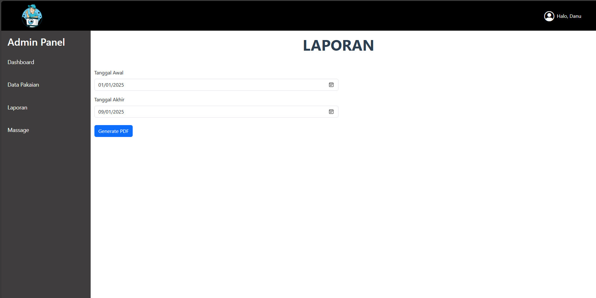
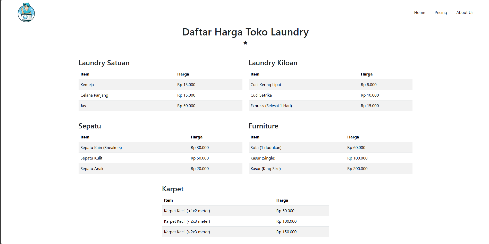

# LAUNDRY

<p align="center"></p>


## Pengenalan Project

Di era modern ini, gaya hidup masyarakat semakin sibuk dengan berbagai aktivitas, baik di bidang pekerjaan, pendidikan, maupun rumah tangga. Hal ini sering kali membuat waktu untuk mengerjakan pekerjaan rumah tangga, seperti mencuci dan menyetrika pakaian, menjadi terbatas. Sementara itu, kebutuhan akan pakaian yang bersih, rapi, dan wangi tetap menjadi prioritas utama bagi setiap individu, terutama untuk menunjang penampilan sehari-hari.
Melihat permasalahan tersebut, jasa laundry hadir sebagai solusi praktis untuk memenuhi kebutuhan masyarakat akan layanan pencucian pakaian yang cepat, bersih, dan berkualitas. Dengan teknologi modern dan pelayanan profesional, usaha laundry menjadi pilihan yang diminati, khususnya di daerah perkotaan atau kawasan padat penduduk.
Selain itu, pertumbuhan permintaan terhadap jasa laundry terus meningkat seiring dengan perubahan gaya hidup masyarakat yang lebih mengutamakan efisiensi waktu. Jasa ini tidak hanya melayani kebutuhan rumah tangga, tetapi juga institusi seperti hotel, restoran, kos-kosan, hingga perkantoran yang memerlukan layanan pencucian skala besar.
Dengan adanya potensi pasar yang luas dan terus berkembang, usaha laundry memiliki peluang besar untuk menjadi bisnis yang menguntungkan dan berkelanjutan, terutama jika didukung dengan pelayanan terbaik, harga yang kompetitif, dan inovasi yang berorientasi pada kebutuhan pelanggan.

## Nama Kelompok
<table border="1">
  <thead>
    <tr>
      <td>No</td>
      <td>NIM</td>
      <td>Nama Anggota</td>
    </tr>
  <thead>
  <tbody>
    <tr>
      <td>1</td>
      <td>19231413</td>
      <td>Danu Pangestu</td>
    </tr>
    <tr>
      <td>2</td>
      <td>19231213</td>
      <td>Fitra Hakiki Firdaus</td>
    </tr>
    <tr>
      <td>3</td>
      <td>19231774</td>
      <td>Bimo Syahlendra</td>
    </tr>
    <tr>
      <td>4</td>
      <td>19230861</td>
      <td>Muhammad Haikal Juliansyah</td>
    </tr>
  </tbody>
</table>

## ERD & LRS
<p align="center"></p>
<p align="center"></p>

## Skenario Kebutuhan Pengguna
<strong>Pengguna</strong>
<ol>
<li>mengirim pesan ulasan</li>
<li>dapat melihat harga</li>
</ol>

<strong>Admin</strong>
<ol>
<li>bisa menambah dan mengedit harga </li>
<li>mengelola ulasan dari pelanggan</li>
<li>melihat laporan data pakaian</li>
<li>bisa login</li>
<li>bisa mendaftar akun baru</li>
</ol>
<!-- Sesuaikan dengan hak akses dari project masing-masing kelompok -->

## Pra-Install
Sebelumnya pastikan menginstall terlebih dahulu kebutuhan sistem untuk menggunakan project ini.
- [x] Git
- [x] Composer
- [x] Code Editor <code>VS Code, Sublime Text atau sejenisnya</code>
- [x] Web Server <code>Laragon, Xampp atau sejenisnya</code>
- [x] Web Browser <code>Chrome, Mozilla atau sejenisnya</code>
- [x] Node.js <code>(opsional)</code>

## Cara Install
1. Cloning repository ini melalui terminal. Tunggu hingga selesai cloning.
```
git clone https://github.com/Kikiqis/laundry.git
```
<!-- Ubah link diatas dengan link repository yang kalian -->

2.  Buka project menggunakan Code Editor, lalu inisiasi dependensi composer melalui terminal.
```
composer install
```
3. Duplikat file `.env.example` menjadi `.env` dan konfigurasikan koneksi database menjadi seperti ini pada file `.env`
```
DB_CONNECTION=mysql
DB_HOST=127.0.0.1
DB_PORT=3306
DB_DATABASE=db_laundry
DB_USERNAME=root
DB_PASSWORD=
```
<!-- Ubah nama DB sesuai nama DB projectnya -->

4. Generate key aplikasi pada env melalui terminal.
```
php artisan key:generate
```
5. Generate Storage Link melalui terminal agar dapat mengakses storage.
```
php artisan storage:link
```
6. Migrasikan tabel beserta seeder melalui terminal.
```
php artisan migrate:fresh --seed
```

## Screenshot
<table width="100%">
<tr>
<td><h3 align="center">halaman login</h3></td>
<td><h3 align="center">halaman dashboard</h3></td>
</tr>
<tr>
<td><h3 align="center">halaman data pakaian</h3></td>
<td><h3 align="center">halaman tambah pakaian</h3></td>
</tr>
<tr>
<td><h3 align="center">halaman edit pakaian</h3></td>
<td><h3 align="center">halaman laporan</h3></td>
</tr>
<tr>
<td><h3 align="center">hasil cetak laporan</h3></td>
<td><h3 align="center">halaman ulasan pelanggan</h3></td>
</tr>
<tr>
<td><h3 align="center">halaman home</h3></td>
<td><h3 align="center">lanjutan halaman home</h3></td>
</tr>
<tr>
<td><h3 align="center">halaman about us</h3></td>
<td><h3 align="center">halaman pricing</h3></td>
</tr>
</table>

## Lisensi

Project ini dibuat untuk menyelesaikan project mata kuliah Web Programming II Universitas Bina Sarana Informatika (UBSI) yang diampu oleh Bpk. <a href="https://github.com/yuris60">Yuris Alkhalifi, M.Kom., CPDSA</a> selaku Dosen. Project ini bersifat open source untuk edukasi.
<!-- Kalian boleh mengubah bentuk lisensi ini sesuai kesepakatan kelompok apakah akan bersifat open source atau tidak -->
<blockquote>Kuliah...? BSI AJA !!</blockquote>

